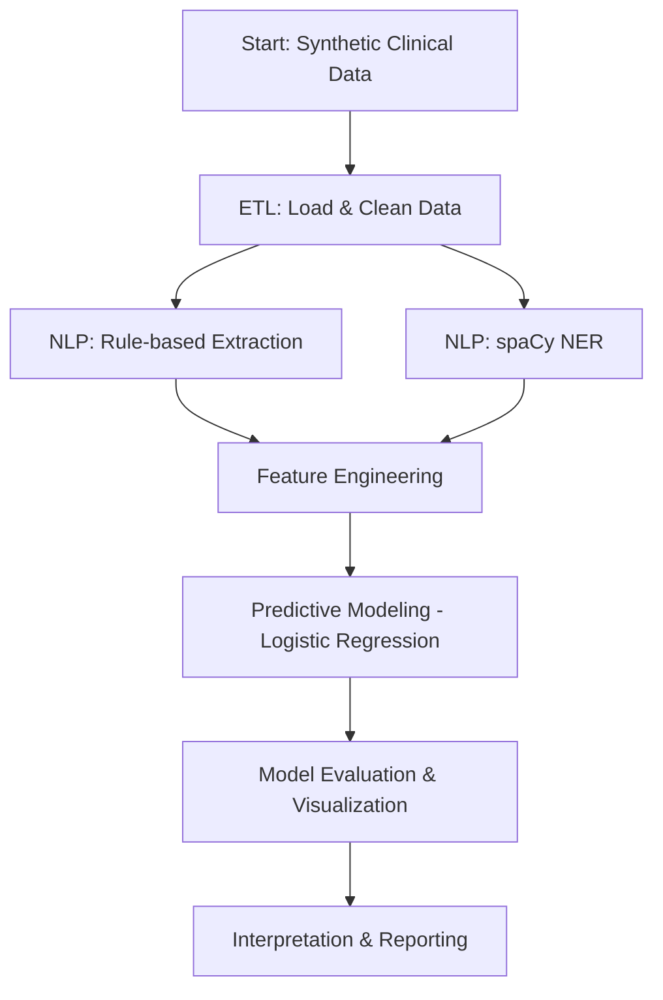

# Clinical NLP Portfolio

A portfolio project demonstrating expertise in Natural Language Processing (NLP), clinical data analysis, ETL, predictive modeling, and client-facing reporting for healthcare research.

## Project Overview
This repository showcases:

## Workflow Diagram

Below is a visual summary of the end-to-end workflow using Mermaid:

## Structure
- `data/` – Sample clinical notes and EHR data (de-identified)
- `notebooks/` – Jupyter notebooks for exploration, modeling, and reporting
- `src/` – Python modules for ETL, NLP, modeling, and utilities
- `reports/` – Generated reports and client deliverables

## Getting Started
1. Clone the repository
2. Install dependencies: `pip install -r requirements.txt`
3. Explore notebooks in `notebooks/`
4. Run ETL and modeling scripts in `src/`

## Example Use Cases
- Extract disease phenotypes from clinical notes
- Predict patient risk for conditions
- Generate client-ready reports

## Compliance
This project simulates privacy and IRB compliance for demonstration purposes. No real patient data is used.

## Further Development
- Integrate real or more complex synthetic datasets
- Expand NLP with custom entity recognition and context analysis
- Explore additional models (e.g., random forest, XGBoost)
- Add privacy/compliance checks and reporting modules
- Enhance documentation and client-facing summaries

## Contact
For more information, reach out to Justin or view the job description in the repository.
