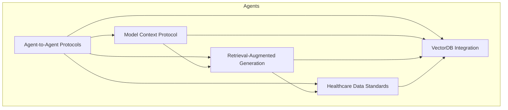
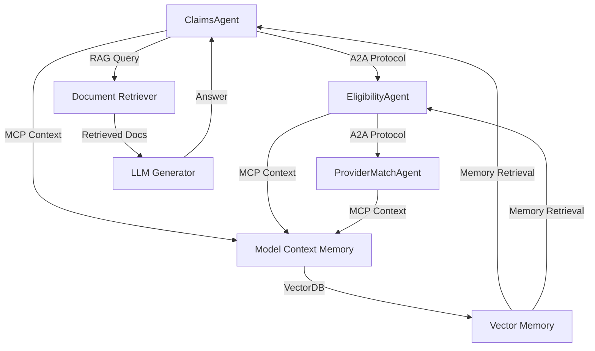
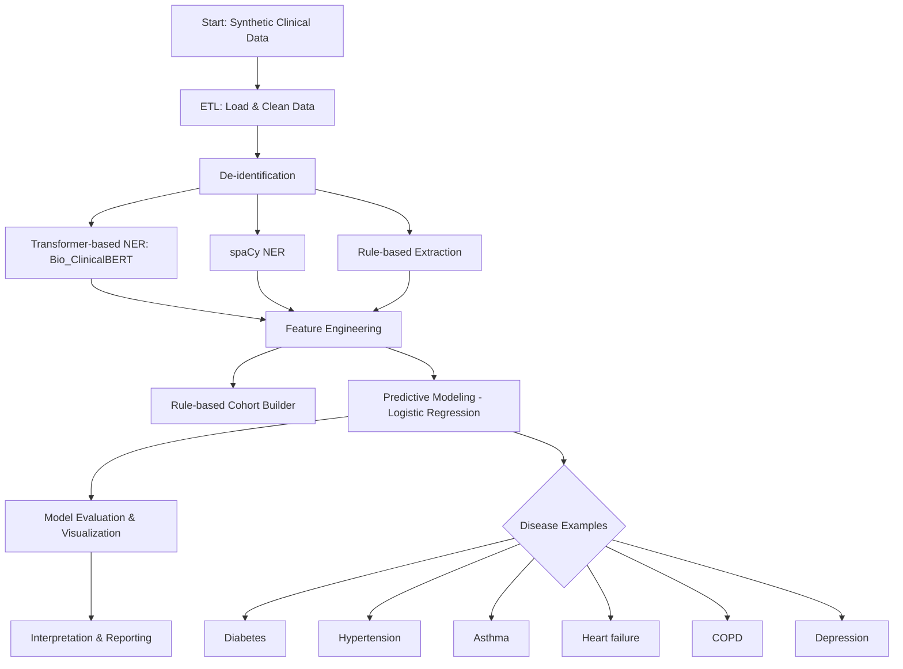

# Clinical NLP Portfolio

A portfolio project demonstrating expertise in Natural Language Processing (NLP), clinical data analysis, ETL, predictive modeling, and client-facing reporting for healthcare research.

## Project Overview
This repository showcases:

## Agentic Architectures & Protocols Notebook

## NLP Agents Architecture Overview

- **Agent-to-Agent Protocols (A2A):** Agents communicate and collaborate using standardized message-passing protocols, allowing for distributed decision-making and workflow automation.
- **Model Context Protocol (MCP):** Provides persistent, context-aware memory for agents, enabling them to track interactions, decisions, and patient-specific information over time.
- **Retrieval-Augmented Generation (RAG):** Combines document retrieval with large language model (LLM) generation to answer complex clinical questions using both structured and unstructured data.
- **Healthcare Data Standards:** Integrates FHIR and ICD parsers to ensure interoperability and compliance with healthcare data standards.
- **VectorDB Integration:** Implements vector-based memory for agents, supporting semantic search, similarity matching, and efficient retrieval of clinical information.

### Architectural Principles

- **Modularity:** Each component is implemented as a separate module, making the architecture extensible and maintainable.
- **Agentic Intelligence:** Agents act autonomously, collaborate, and share context, supporting complex multi-agent workflows.
- **Interoperability:** Built-in support for healthcare standards ensures compatibility with real-world clinical systems.
- **Scalability:** The architecture supports integration with cloud-native and MLOps workflows for production deployment.

### Mermaid Diagram: NLP Agents Architecture

### Agentic Architecture Overview (Mermaid)

## Workflow Diagram

Below is a visual summary of the end-to-end workflow using Mermaid:

## Structure
- `data/` – Sample clinical notes and EHR data (de-identified)
- `notebooks/` – Jupyter notebooks for exploration, modeling, and reporting
- `src/` – Python modules for ETL, NLP, modeling, and utilities
- `reports/` – Generated reports and client deliverables

## Getting Started
1. Clone the repository
2. Install dependencies: `pip install -r requirements.txt`
3. Explore notebooks in `notebooks/`
4. Run ETL and modeling scripts in `src/`

## Example Use Cases
- Extract disease phenotypes from clinical notes
- Predict patient risk for conditions
- Generate client-ready reports

## Advanced NLP Features

## Large Language Model (LLM) Usage: Bio_ClinicalBERT

This project leverages Bio_ClinicalBERT, a domain-specific large language model (LLM) based on BERT and pre-trained on clinical and biomedical text. Bio_ClinicalBERT is used for advanced Named Entity Recognition (NER) to extract disease and symptom entities from clinical notes with high accuracy.

**How Bio_ClinicalBERT is used:**
- Loaded via Hugging Face Transformers in the notebook and code modules
- Used for direct inference (entity extraction) on clinical notes
- Optionally fine-tuned with custom labeled data for specialized NER tasks
- Compared with spaCy and rule-based extraction for benchmarking

**Why Bio_ClinicalBERT?**
- Recognizes medical terminology and entities better than general-purpose models
- Widely adopted in healthcare AI research and production

See the notebook for code examples of both inference and (optional) fine-tuning with Bio_ClinicalBERT.

## Advanced NLP Features
- Fine-tune and evaluate transformer-based NER models on clinical notes (`run_advanced_ner`)
- Use rule-based logic for cohort selection (e.g., T2D phenotyping, `assess_t2d_cohort`)
- De-identify notes before NLP and modeling (`deidentify_text`)
- Compare transformer-based NER with spaCy and rule-based extraction
- Visualize and interpret model outputs in the notebook

## Compliance
This project simulates privacy and IRB compliance for demonstration purposes. No real patient data is used.

## Further Development

## Expanding Disease Risk Prediction

This pipeline can be easily extended to predict risk for other diseases. Currently, diabetes, hypertension, and asthma are included. To add more:

- Update the target variable to the disease of interest (e.g., heart failure, COPD, depression)
- Use the same feature engineering and modeling steps
- For multi-class prediction, use multiclass classifiers (e.g., multinomial logistic regression, random forest)

**Examples of diseases to expand:**
- Heart failure
- COPD
- Depression
- Any disease present in the dataset

See the notebook for code examples and guidance.

## Contact
For more information, reach out to Justin.
