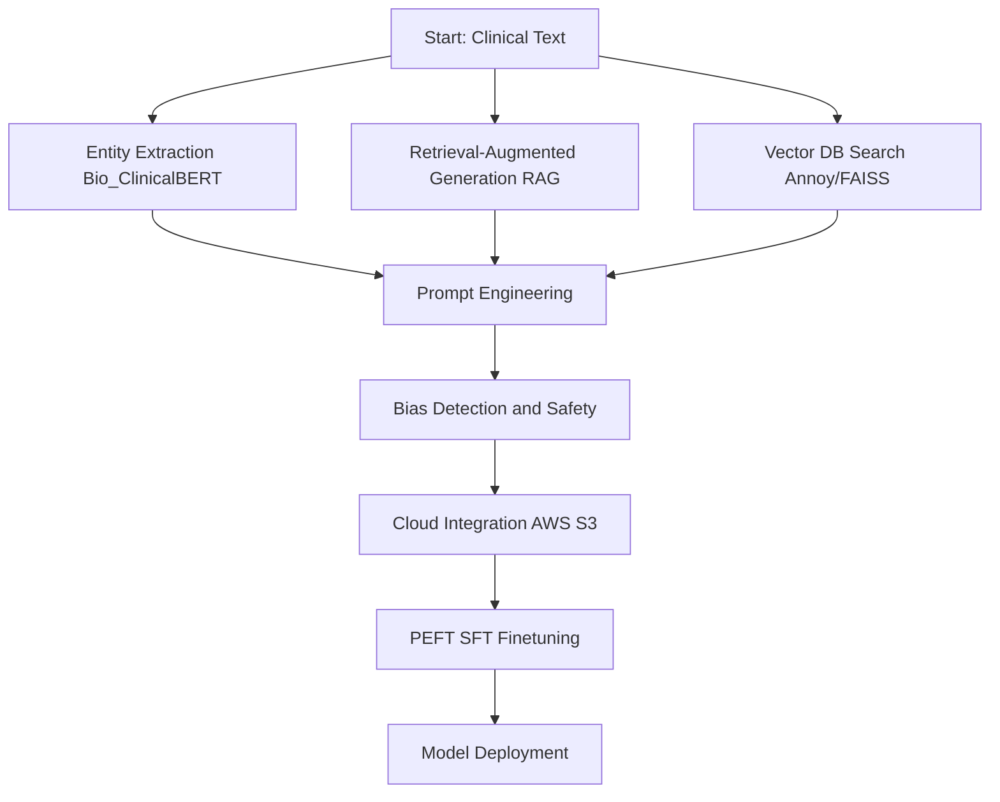

# Clinical & GenAI NLP Portfolio

A comprehensive portfolio project demonstrating advanced expertise in Clinical Natural Language Processing (NLP), Generative AI, and data science. This repository showcases the complete lifecycle of a healthcare AI project, from ETL and de-identification of synthetic clinical data to predictive modeling, agentic architecture design, and client-ready reporting.

## 🚀 Value Proposition

This project is designed to simulate a real-world healthcare AI research environment, highlighting key skills:
*   **Advanced NLP & LLMs:** Fine-tuning and deploying domain-specific models like Bio_ClinicalBERT for clinical entity recognition.
*   **Generative AI:** Implementing Retrieval-Augmented Generation (RAG), vector databases, and prompt engineering for clinical Q&A.
*   **Agentic Systems:** Designing multi-agent architectures with standardized protocols (A2A, MCP) for automated workflows.
*   **End-to-End ML Pipeline:** Expertise in data ETL, feature engineering, predictive modeling (e.g., logistic regression for disease risk), and evaluation.
*   **Healthcare Compliance:** Built-in de-identification and adherence to healthcare data standards (FHIR, ICD).

## ✨ Features

*   **Transformer-Based NER:** Extraction of medical concepts using Bio_ClinicalBERT from Hugging Face.
*   **Multi-Agent Architecture:** Demonstrates agent-to-agent (A2A) communication and context management with Model Context Protocol (MCP).
*   **Retrieval-Augmented Generation (RAG):** A working RAG pipeline for answering complex clinical questions.
*   **Vector Database Integration:** Semantic search and efficient memory retrieval using Annoy and FAISS/Chroma.
*   **Predictive Modeling:** Logistic regression models for predicting patient disease risk (e.g., Diabetes, Hypertension).
*   **Healthcare Interoperability:** Parsers and utilities for FHIR and ICD standards.
*   **Cloud & MLOps Ready:** Examples and patterns for deploying models to AWS and implementing MLOps practices.

## 📁 Project Structure

```
.
├── data/               # Sample synthetic clinical notes and EHR data (de-identified)
├── notebooks/          # Jupyter notebooks for exploration, modeling, and reporting
│   └── advanced_genai_features_demo.ipynb  # Main demo notebook
├── src/                # Python source modules
│   ├── etl.py          # Data loading and cleaning utilities
│   ├── nlp.py          # NLP functions (NER, de-identification)
│   ├── modeling.py     # Predictive modeling routines
│   └── utils.py        # Helper functions
├── reports/            # Generated client deliverables and reports
└── requirements.txt    # Python dependencies
```

## 🏗️ Agentic Architectures & Protocols

The project implements a forward-looking multi-agent architecture for clinical decision support.

### Architectural Overview


### Example Agent Workflow


## 🔬 Technical Workflow

The end-to-end data science and NLP pipeline is visualized below:


## 🛠️ Installation & Usage

1.  **Clone the repository:**
    ```bash
    git clone <your-repo-url>
    cd clinical-nlp-portfolio
    ```

2.  **Install dependencies:**
    It is recommended to use a virtual environment (`venv` or `conda`).
    ```bash
    pip install -r requirements.txt
    ```

3.  **Explore the project:**
    *   The main demonstration is in `notebooks/advanced_genai_features_demo.ipynb`.
    *   Run ETL and modeling scripts from the `src/` directory.

## 📓 Advanced GenAI Features Demo Notebook

The flagship notebook (`notebooks/advanced_genai_features_demo.ipynb`) is a recruiter-ready deep dive into modern clinical AI, showcasing:

**Section Overview:**
1.  **Entity Extraction & Classification:** Advanced NER with Hugging Face's Bio_ClinicalBERT.
2.  **RAG Pipeline:** A complete Retrieval-Augmented Generation system for clinical question answering.
3.  **VectorDB Integration:** Semantic search implementations with Annoy and FAISS.
4.  **Prompt Engineering & Finetuning:** Strategies for optimizing LLM interactions and conceptual fine-tuning workflows.
5.  **Bias Detection & Safety:** Implementing model guardrails and fairness checks.
6.  **Cloud Integration (AWS):** Code examples for model and data storage in S3.
7.  **PEFT/SFT Finetuning:** Setup for parameter-efficient fine-tuning using Hugging Face PEFT and LoRA.

The notebook workflow is modular, allowing sections to be understood and run independently.



## 🔮 Further Development

The pipeline is designed for extension:
*   **New Disease Prediction:** Easily adapt the model to predict heart failure, COPD, depression, or any condition present in the data by modifying the target variable.
*   **New Agents:** Implement additional agents for tasks like prior authorization or clinical trial matching using the established A2A protocol.
*   **Real Data Integration:** The architecture supports plugging in real FHIR servers or EHR data streams.

## ⚠️ Compliance Note

**This project uses only synthetic, de-identified data.** It is designed to simulate privacy-aware development practices and IRB compliance for demonstration purposes. No real Protected Health Information (PHI) is used.

## 📧 Contact

For questions or more information, please reach out to **Justin**.

---